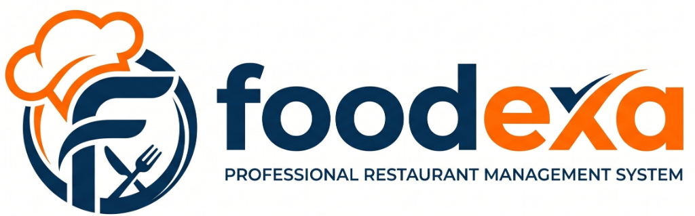

  

# Foodexa - المنظومة الذكية المتكاملة لإدارة المطاعم وتلقي الطلبات أونلاين 🍽️🚀

> **رابط المعاينة والموقع الرسمي للمنظومة:**  
> 🌐 **[https://foodexa.online](https://foodexa.online)**

---

**Foodexa** هي منظومة سحابية ومحلية متكاملة ومستقلة، صُممت خصيصاً لمساعدة المطاعم والكافيهات على زيادة مبيعاتهم أونلاين، تنظيم تشغيل الصالة والمطبخ، وتتبع المخازن بدقة متناهية، مع التخلص التام من رسوم المنصات والوساطة الشهرية.

تمتاز المنظومة بربط ذكي ومباشر مع تطبيق **WhatsApp** لإرسال الفواتير التلقائية وتتبع حالة الطلب للزبائن لحظة بلحظة.

---

## 🌐 لغة المستند / Document Language
- [English Showcase (#english)](#english)
- [العرض التفصيلي باللغة العربية (#arabic)](#arabic)

---

# العرض التفصيلي باللغة العربية 🇪🇬

## ✨ القيمة التنافسية لنظام Foodexa
تعتمد معظم المطاعم اليوم على منصات وسيطة تقتطع نسباً ضخمة من الأرباح وتتحكم في بيانات العملاء. يوفر **Foodexa** بديلاً مستقلاً بالكامل (Self-Hosted) يمنحك السيطرة الكاملة على علامتك التجارية وعملائك، مع إتاحة نظام بيئي رقمي موحد يربط كافة أقسام المطعم بشكل لحظي.

---

## 🔄 رحلة العميل الرقمية (Customer Journey)

تم تصميم النظام ليكون سلساً وتلقائياً بالكامل، حيث تسير رحلة طلب العميل كالتالي:

1. **📱 استعراض المنيو والطلب:**
   - يفتح العميل رابط المنيو أونلاين [foodexa.online/delivery](https://foodexa.online/delivery/) من هاتفه (PWA).
   - يختار العميل وجباته ومكوناتها المفضلة والإضافات، ويملأ بياناته (الاسم، الهاتف، العنوان بالتفصيل).
   - يختار طريقة الدفع المفضلة (كاش، فودافون كاش، إنستا باي).
2. **💬 فاتورة واتساب التلقائية:**
   - بمجرد إرسال الطلب، يتلقى العميل رسالة فورية على حسابه في **WhatsApp** تحتوي على الفاتورة التفصيلية، وعنوانه، ورابط مباشر للتتبع والشات، بالإضافة إلى **كود أمان (Security PIN) مكون من 4 أرقام** لتأمين حسابه وتتبع طلبه.
3. **🍳 مراجعة الإدارة والتحضير:**
   - يظهر الطلب فوراً في لوحة الكاشير ولوحة المطبخ (KDS).
   - عند مراجعة الكاشير وإرسال الطلب للتحضير، يتلقى العميل إشعاراً على **WhatsApp**: *"تم تأكيد طلبك وجاري تحضيره في المطبخ الآن! 🍳🔥"*.
4. **🚴 التوصيل الذكي:**
   - بعد انتهاء المطبخ من تحضير الأكل، يتم تعيين طيار دليفري.
   - يتلقى العميل إشعاراً على **WhatsApp** يعلمه بأن *"أوردرك جاهز وخرج للتوصيل الآن مع الطيار (اسم الطيار)! 🚴‍♂️💨"*.
5. **🍔 التسليم والتقييم:**
   - يقوم الطيار بتسليم الأوردر وتحديث الحالة إلى "تم التوصيل".
   - يتلقى العميل رسالة شكر على **WhatsApp** تدعوه لتقييم وجبته وخدمته عبر رابط مباشر يفتح شاشة التقييم التفاعلية في المنيو.

---

## 🧩 الأقسام ولوحات التحكم المدعومة

تم بناء وتصميم لوحات تحكم متخصصة ومستقلة لكل دور وظيفي داخل المطعم، تتصل جميعاً بقاعدة بيانات مركزية لحظية:

### 1. منيو الطلبات والدليفري أونلاين (PWA Client Menu)
* **تطبيق ويب تقدمي (PWA):** يمكن للعملاء تثبيته على هواتفهم (Android & iOS) بلمسة واحدة ليعمل كـ App مستقل.
* **عروض حية ومتحركة:** شريط إعلاني ذكي ومتحرك لعرض الخصومات اليومية للمطعم.
* **إرسال الطلبات الذكي:** يتيح للعميل اختيار الإضافات والمكونات وتحديد طريقة الدفع (كاش، فودافون كاش، إنستا باي) مع إمكانية رفع إيصال التحويل مباشرة.
* **محادثة مباشرة (Live Chat):** محادثة حية ومشفرة بين العميل والإدارة للاستفسار عن الأوردر وتحديثاته دون مغادرة الصفحة.
* **تتبع فوري:** شاشة لتتبع حالة الطلب (جديد، جاري التحضير، خرج للتوصيل، تم التوصيل).

### 2. لوحة التحكم الإدارية (Admin Control Panel)
* **إدارة المنيو والأقسام:** إضافة وتعديل الوجبات، الأسعار، المكونات، والإضافات (Extras) وحالة التوفر.
* **مراقبة المبيعات الحية:** لوحة تحليلات تفاعلية تعرض المبيعات اليومية والشهرية، تقارير الأرباح، والتقييمات المستلمة من الزبائن.
* **مركز المحادثات الموحد:** شاشة شات فورية للرد على استفسارات كافة العملاء بشكل منظم.
* **تهيئة إعدادات المطعم:** ضبط اسم المطعم، الشعار، أرقام وعناوين الدفع الإلكتروني (فودافون كاش وإنستاباي).

### 3. لوحة استقبال الطلبات (Call Center)
* **واجهة إدخال فائقة السرعة:** مصممة لموظفي استقبال المكالمات لتسجيل بيانات العميل (الاسم، الهاتف، العنوان بالتفصيل) وإضافة الأصناف في ثوانٍ معدودة وإرسالها فوراً للمطبخ.
* **تاريخ طلبات العميل:** استعراض سريع لآخر طلبات العميل لتسريع عملية الطلب.

### 4. لوحة الكاشير ونقاط البيع (Cashier POS)
* **إدارة الطاولات والصالة:** عرض مرئي لحالة الطاولات (فارغة، مشغولة، قيد الحساب).
* **إدارة شفتات الكاشير:** تسجيل مبالغ البدء والانتهاء، احتساب العجز والزيادة، وتسجيل المدفوعات الواردة والخارجة بالتفصيل.
* **طباعة الفواتير:** فواتير متوافقة مع الطابعات الحرارية (Thermal Printers).

### 5. لوحة شاشة المطبخ (Kitchen Display Screen - KDS)
* **تحديث فوري للطلبات:** شاشة تفاعلية تظهر للطهاة فور تسجيل أي طلب من الكاشير أو الكول سنتر أو الأونلاين.
* **ترتيب ذكي:** تنظيم الأوردرات حسب الأولوية وزمن الطلب مع إمكانية تحديث الحالة إلى "جاهز للتسليم" بلمسة واحدة.

### 6. لوحة إدارة المخازن والجرد (Inventory & Stock Control)
* **ربط المكونات بالوجبات:** يتم ربط كل وجبة بمكوناتها الخام في المخزن (مثال: برجر اللحم يحتاج 150 جرام لحم، خبز، قطعة جبن).
* **خصم تلقائي لحظي:** بمجرد تأكيد أي أوردر، يقوم النظام تلقائياً بخصم المكونات من المخزن.
* **نظام التنبيه المبكر:** إشعار الإدارة فوراً عند اقتراب أي خامة من النفاد لضمان عدم توقف التشغيل.

### 7. شاشة الصالة والانتظار (Waiting Status Board)
* شاشة كبيرة تُعلق في صالة الانتظار تعرض أرقام الطلبات الجاهزة للاستلام والطلبات قيد التحضير لتنظيم طوابير الانتظار، مع إمكانية عرض إعلانات متحركة وعروض خاصة.

### 8. تطبيق الويترز المحمول (Waiter Portal)
* واجهة سريعة وخفيفة تمكن الويترز من تسجيل الطلبات مباشرة من الهاتف بجانب طاولة الزبون وإرسالها للمطبخ والكاشير فوراً دون الحاجة لتدوينها ورقياً.

---

## ⚡ الميزات التقنية الاستثنائية

1. **الربط الآلي التلقائي بـ WhatsApp:**
   بمجرد طلب العميل أو تحديث حالة الطلب، يقوم النظام بإرسال رسالة واتساب منسقة وتلقائية تحتوي على تفاصيل الفاتورة، كود الأمان، ورابط مباشر للتتبع والشات الحي.
2. **العمل دون اتصال (Offline-First Support):**
   تعتمد لوحات التشغيل (الكاشير والمطبخ والويتر) على التخزين المحلي المؤقت (`IndexedDB`) لضمان استمرار تسجيل الطلبات والتشغيل حتى عند انقطاع الإنترنت، ثم مزامنة البيانات تلقائياً فور عودة الاتصال.
3. **تحديث البيانات اللحظي (Real-time WebSockets):**
   تنتقل البيانات بين المطبخ، الكاشير، والعميل أونلاين في جزء من الثانية بدون الحاجة لتحديث الصفحة.

---

## 🛠️ البنية البرمجية والتقنيات (Tech Stack)

* **الواجهات الأمامية:** HTML5, CSS3 (Vanilla), JavaScript (ES6+ with WebSockets).
* **خادم الويب والربط الذكي:** Node.js, Express, `whatsapp-web.js` (Puppeteer for headless WhatsApp connection).
* **الخلفية وقاعدة البيانات:** PocketBase (Go-based application framework) مع قاعدة بيانات SQLite فائقة السرعة والموثوقية.
* **البيئة والحاويات:** Docker & Docker Compose للتشغيل السريع والمعزول في بيئات الإنتاج.

---

# English Showcase 🇺🇸

## ✨ Value Proposition
Most restaurants rely on third-party aggregators that slice away profit margins and restrict direct customer communication. **Foodexa** offers a self-hosted alternative that gives you total control over your branding, client databases, and revenue, powered by an instantaneous WebSocket-driven operational backend.

> **Official Website & Demo:**  
> 🌐 **[https://foodexa.online](https://foodexa.online)**

---

## 🔄 The Digital Customer Journey

The system orchestrates a fully automated order processing pipeline:

1. **📱 Menu Browsing & Order Placement:**
   - The customer visits the web menu [foodexa.online/delivery](https://foodexa.online/delivery) on their phone (PWA).
   - They customize their meals (selection of toppings, ingredients, extras), enter delivery details, and choose a payment method.
2. **💬 Automated WhatsApp Invoice:**
   - Upon submission, the customer instantly receives a **WhatsApp message** detailing their invoice summary, delivery address, a live tracking/chat link, and a **4-digit Security PIN** to securely authenticate tracking and chat features.
3. **🍳 Kitchen Prep:**
   - The order hits the Cashier POS and Kitchen Display Screen (KDS) immediately.
   - Once the cashier confirms the order, the customer receives a **WhatsApp notification**: *"Your order has been approved and is now being prepared in the kitchen! 🍳🔥"*.
4. **🚴 Delivery Dispatch:**
   - When the kitchen finishes preparation, a driver is assigned.
   - The customer receives a **WhatsApp update**: *"Your order is ready and out for delivery with [Driver Name]! 🚴‍♂️💨"*.
5. **🍔 Handover & Rating:**
   - The driver delivers the hot meal and marks it as "Delivered".
   - The customer receives a **WhatsApp follow-up** with a direct rating link, allowing them to instantly rate the food quality and delivery service in the PWA interface.

---

## 🧩 Modules & Dashboards

A dedicated, specialized interface is custom-tailored for each operational role within the restaurant:

### 1. Online Delivery & Ordering Menu (PWA Client Menu)
- **Progressive Web App (PWA):** Installs seamlessly on iOS & Android devices.
- **Dynamic Promo Banners:** Smooth, auto-scrolling ticker highlighting daily deals and coupons.
- **Rich Checkout:** Supports custom extras, dietary details, and payment options (Cash, Vodafone Cash, Instapay) with direct screenshot attachments for transfer validations.
- **Direct Live Chat:** Real-time customer-to-management chat interface with automated welcoming.
- **Order Tracking:** Real-time progress bar tracking orders from placement to delivery.

### 2. Admin Control Panel
- **Menu Management:** Control categories, items, pricing, availability, and ingredients.
- **Live Analytics:** Track daily/monthly revenue, profit margins, active orders, and customer ratings.
- **Consolidated Chat Inbox:** Centralized live chat dashboard to converse with all customers.
- **Global Settings:** Modify shop metadata, PWA logos, and configurations.

### 3. Call Center Dashboard
- **Rapid Telephone Ordering:** Fast user lookup, delivery address auto-completion, and order entry interface designed for phone operators.
- **Order History:** Quick review of previous orders per customer.

### 4. Cashier & POS Module
- **Interactive Table Map:** Visual mapping of table availability, seat counts, and bill totals.
- **Cashier Shifts:** Track opening cash, record paid-ins/paid-outs, and compute shift closeout differences.
- **Receipt Printing:** Thermal receipt printer styling support.

### 5. Kitchen Display Screen (KDS)
- **Live Cooking Ticket Queue:** Real-time order dispatch to kitchen displays.
- **One-Touch Completion:** Instantly flags tickets as ready, notifying the cashier and dispatching customer updates.

### 6. Inventory & Stock Management
- **Recipe Management:** Link menu items to raw stock components.
- **Auto-Deduction:** Real-time stock consumption upon order placement.
- **Low Stock Warnings:** Immediate warnings when vital ingredients fall below safe thresholds.

### 7. Waiter Portal
- Mobile-friendly tablets/phones UI for waiters to record and send orders instantly from tables to the kitchen and POS.

### 8. Order Status Screen Board
- Large monitor interface showing "Preparing" and "Ready" ticket numbers, reducing customer wait-time confusion.

---

## ⚡ Exceptional Tech Highlights

1. **Automated WhatsApp Gateways:**
   Dispatches formatted WhatsApp invoices, security pins, and tracking links to clients dynamically.
2. **Offline-First Resilience:**
   POS and Waiter panels utilize browser `IndexedDB` storage to record actions during network drops, syncing back once online.
3. **Sub-second Sync (WebSockets):**
   Real-time data synchronization across all devices and panels.

---

## 🛠️ Tech Stack

- **Front-end:** HTML5, CSS3, JavaScript (ES6+), WebSockets.
- **Middleware & Worker:** Node.js, Express, `whatsapp-web.js` (Puppeteer Chromium instance).
- **Backend & Database:** PocketBase (Go) with a structured SQLite engine.
- **Deployment:** Docker & Docker Compose.
